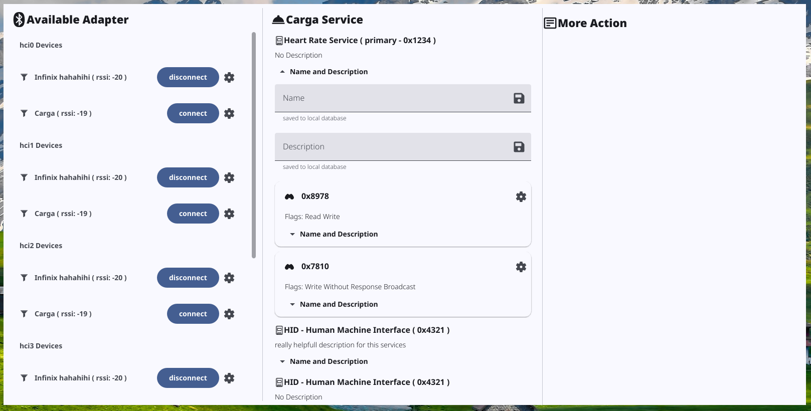

<p align="center">
  <a href="">
    
  </a>
  <a href="">
    
  </a>
  <a href="">
    
  </a>
  <a href="https://github.com/ahsanu123/wojo/blob/main/LICENSE">
    
  </a>
</p>
<p align="center">
  <b>
    🦷 Wojo - bluetooth client emulator app
  </b>
</p>

 
 

### Logs 

- 4 juli 2025, able to list all service and characteristic from bluetooth peripheral with `bluest`.
but to be able list all service and characteristic pc need to connect it first, then `bluest` able to read.
- another try using `btleplug`, its seem more robust (at least from the example)
- 3 April 2026 exploring btleplug structure and possibilities

<details>
  <summary>
    test result 
  </summary>


```shell
running 1 test
adapters: [Adapter { session: BluetoothSession, adapter: AdapterId { object_path: Path("/org/bluez/hci0\0") } }]
-------------------------------------------
adapter-info: Ok(
    "hci0 (usb:v1D6Bp0246d0556)",
)
[
    Peripheral {
        session: BluetoothSession,
        device: DeviceId {
            object_path: Path(
                "/org/bluez/hci0/dev_FF_E4_05_08_8F_FF\0",
            ),
        },
        mac_address: FF:E4:05:08:8F:FF,
        services: Mutex {
            data: {},
            poisoned: false,
            ..
        },
    },
]
-------------------------------------------
Some(
    PeripheralProperties {
        address: FF:E4:05:08:8F:FF,
        address_type: Some(
            Random,
        ),
        local_name: Some(
            "carga",
        ),
        advertisement_name: Some(
            "carga",
        ),
        tx_power_level: None,
        rssi: Some(
            -74,
        ),
        manufacturer_data: {},
        service_data: {},
        services: [
            0000180f-0000-1000-8000-00805f9b34fb,
            00001812-0000-1000-8000-00805f9b34fb,
        ],
        class: None,
    },
)
-------------------------------------------
available services
service name -> Battery Service
service name -> Human Machine Interface
test ble::ble_tests::test_list_ble_adapters ... ok

test result: ok. 1 passed; 0 failed; 0 ignored; 0 measured; 1 filtered out; finished in 10.11s
```
  
</details>

### 🎄 References

- https://github.com/deviceplug/btleplug
- https://github.com/ahsanu123/blendr
- https://github.com/alexmoon/bluest


